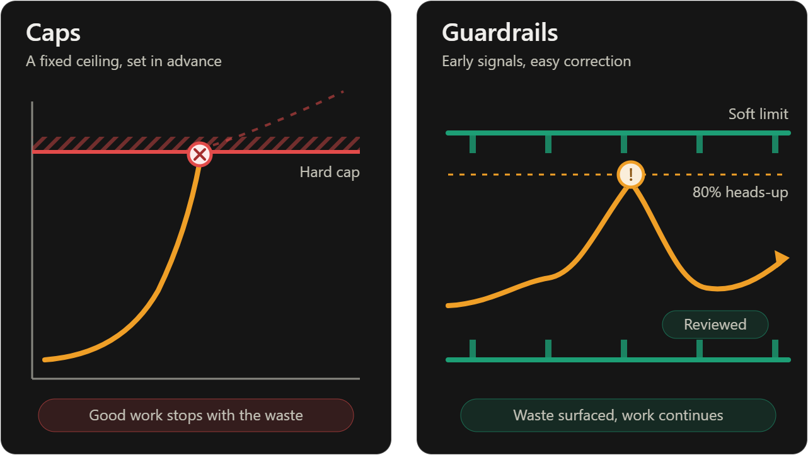

# Caps vs Guardrails: How to Control Engineering Spend Without Killing Velocity

Token bill is the newest version of an old fight between finance and
engineering.

<!-- more -->

Earlier this year, Meta reportedly ran an internal leaderboard called
Claudeonomics. It let 85,000 employees compete to be the top AI token
consumer, and total consumption hit 60 trillion tokens in a single month.
Around the same time, news broke that Uber had exhausted its entire 2026 AI
budget by April ([Faros AI](https://www.faros.ai/blog/tokenmaxxing)).

The reaction came fast. Meta shut down its internal token spend leaderboard,
and Microsoft canceled Claude Code licenses as token costs mounted. Meta's
Adam Mosseri also said token budgets could soon be capped per engineer
([TechCrunch](https://techcrunch.com/2026/07/14/metas-adam-mosseri-says-ai-token-budgets-could-soon-be-capped-per-engineer/)).

Then the arguments started. On X, some engineers and founders defended heavy
spending as the price of leverage, while others called it reckless. The debate
keeps circling one question: **should we cap spend, or trust engineers to
spend?**

We think that's the wrong question. Both answers fail, and there's a third
option.

## Why "just cap it" fails

Caps feel responsible. They're easy to explain, easy to enforce, and finance
loves them. But blunt limits break in predictable ways:

- **They punish your best users.** The engineer getting real leverage from a
  long agent session hits the same ceiling as someone idly burning tokens. One
  engineer told The Pragmatic Engineer that a colleague spent $1,400 on a long
  Claude Code session in a single day, and the company was fine with it because
  of the leverage it saw. A flat cap would have cut that off
  ([The Pragmatic Engineer](https://blog.pragmaticengineer.com/the-pulse-token-spend-breaks-budgets-what-next/)).
- **They're a guess made in advance.** A monthly number set in January says
  nothing about what work will matter in March.
- **They hide the real question.** A cap tells you how much was spent, not
  whether it was worth it.
- **They invite workarounds.** People route around limits: personal accounts,
  shadow tools, or batching work to the reset date.
  <!-- TODO: add a real Reddit/HN quote here (r/ExperiencedDevs, r/devops) -->

Uber reportedly went this route, capping employees at $1,500 per tool per
month after burning through its budget. That's a reasonable emergency brake.
It isn't a strategy.
<!-- TODO: verify the Uber $1,500 cap against Business Insider / The Information before publishing, or cut this paragraph -->

## Why "no limits" fails too

The opposite extreme has its own problem, and tokenmaxxing is the clearest
example. When spend becomes a status signal, people optimize for the signal.

Linear's COO compared ranking engineers by token spend to ranking a marketing
team by who spent the most money. Khosla Ventures partner Jon Chu argued that
Meta engineers were building bots that loop to burn tokens as fast as possible
because of the policy
([Business Insider via AOL](https://www.aol.com/news/tokenmaxxing-techies-debating-leaderboards-tracking-185800252.html)).

Meanwhile, the productivity picture is mixed. Faros analyzed data from 22,000
developers and found task completion up 34%, but bugs per developer up 54% and
median review time up 5x. More output isn't the same as more value.

Every other budget in a company is tied to outcomes. Marketing spend is
measured against pipeline, headcount against shipping velocity, and cloud
spend against uptime and throughput. Token spend often gets measured against
nothing.

So caps cut spend without measuring value, and no limits reward spend without
measuring value. **The missing piece in both is feedback.**

## Guardrails: a different mental model

A cap says "you may not exceed X." A guardrail says "we'll tell you, early and
automatically, when something looks wrong, and we'll make it easy to correct."

|  | Caps | Guardrails |
|---|---|---|
| **Trigger** | Fixed number | Change in behavior or trend |
| **Timing** | End of month, or when blocked | Near real time |
| **Effect on good work** | Blocks it | Lets it continue |
| **Effect on waste** | Cuts it, along with everything else | Surfaces it for action |
| **What you learn** | How much | Why, and whether it was worth it |
| **Failure mode** | Workarounds and resentment | Alert fatigue if poorly tuned |

Guardrails aren't a softer version of caps. They answer a different question:
not "how much?" but "is this normal, and is it paying off?"

## Five guardrails that work

### 1. Catch anomalies in hours, not weeks

Duolingo's FinOps team describes a dashboard that flagged a sudden 10x spike in
OpenAI costs tied to a specific category of users. Finance and engineering
reverted the costly change in hours rather than weeks
([Duolingo](https://blog.duolingo.com/finops)). That's the model: the alert
triggers a conversation, not a lockout. Detection should sit close to runtime,
with real-time alerts, anomaly detection, and budget thresholds, so teams act
before spend becomes an invoice surprise.

### 2. Tie spend to a unit that means something

"$40,000 on tokens" is a scare number. "$3 per merged PR" or "$0.40 per
resolved ticket" is a decision-making number. Pick a unit your engineers and
finance team both understand, then watch its trend, not just its total.

### 3. Use soft budgets with escalation, not hard stops

Set a per-team expectation. Crossing 80% triggers a heads-up, and crossing 100%
triggers a short conversation with the manager, not a blocked account. The goal
is a human checkpoint, not an automatic shutdown.

### 4. Make the efficient path the default

Most waste isn't malicious. Someone left the most expensive model on for a
trivial task, or a long session ballooned in context. Sensible defaults,
cheaper models for routine work, and shared tips on trimming context do more
than policy memos. Some roundups report teams applying context discipline
cutting token costs by 60 to 90 percent without losing output quality, but
treat that as a vendor-side claim and test it on your own workloads.
<!-- TODO: verify the 60-90% figure against a primary source, or soften/remove -->

### 5. Make every cost-saving change reversible

This is the one most teams skip. If a cost change (a model swap, a stricter
limit, a tighter default) can't be rolled back quickly, people will resist
making it, and rightly so. It's the same reason recommendations pile up in
dashboards. The State of FinOps 2023 report named getting engineers to take
action as the number one pain point
([AWS Cloud Financial Management](https://aws.amazon.com/blogs/aws-cloud-financial-management/10-ways-to-work-with-developers-to-take-action-with-finops-cost-optimize/)).
Engineers hesitate when a mistake is expensive to undo.

## A playbook for this quarter

**If you lead FinOps or finance:**

- Stop reporting only totals. Report unit costs and week-over-week changes.
- Replace one hard cap with an 80%/100% alert-and-review flow.
- Ask engineering what "worth it" looks like for their team, then measure that.

**If you lead engineering:**

- Retire any leaderboard that ranks on raw consumption. If you want to
  celebrate something, celebrate outcomes.
- Share your team's most efficient workflows, not just its heaviest users.
- Agree in advance on who reviews an unusual spike and how fast.

**If you're an individual engineer:**

- Know your own usage. Check your numbers before someone else asks.
- When you spend big, be ready to say what you got for it.

## The principle underneath

The pattern across all of this is the same one FinOps has taught for years:
**you don't control cost by making people afraid to act. You control it by
making action safe.** Give people visibility, feedback, and a fast way to undo
mistakes, and they'll make better calls on their own.

That's the principle we're building Consize around: small changes, verified in
real time, with an automatic way back. If you're curious, the sandbox runs on a single Docker
command.

[Try the Interactive Sandbox](../../getting-started/sandbox.md){ .md-button .md-button--primary }