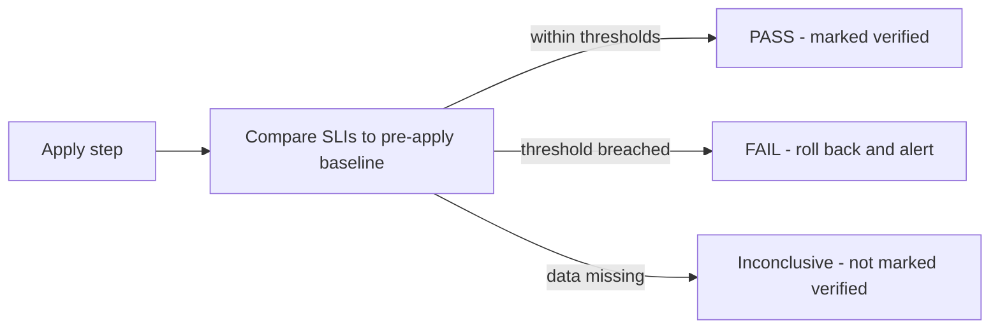

# Inside the Verifier: How Consize Decides When to Roll Back

A successful apply tells you almost nothing about whether a change was safe. The
API accepted the patch, the rollout finished, and everything looks green. The
damage from an over-aggressive cost change shows up later: a memory limit that's
too tight, a database with no headroom, latency creeping up under load.

The Verifier exists to answer one question after every change: **is this system
still behaving the way it did before we touched it?**

<!-- more -->

## Where the Verifier sits

Consize runs the same loop every time: analyze, recommend, review, apply, verify.
The Verifier is the last step, and it's the one that decides whether a change
stays.



Today the signals it watches cover Kubernetes workloads and databases. The idea
behind it doesn't depend on either: measure how the system behaves before a
change, measure again after, and let the difference decide.

## Step 1: Measure the baseline, not an absolute

The Verifier doesn't ask "is latency below 200ms?" It asks "is latency meaningfully
worse than it was before this change?"

That distinction matters. Every service has its own normal. A service that
idles at 5% errors and one that idles at 0.01% shouldn't share a fixed limit, and
a fixed limit would either miss a real regression on the quiet service or fire
constantly on the noisy one. So each check compares the window after the apply
against a window before it.

<!-- TODO: if you want more depth, explain how the baseline window is chosen and what happens when a workload has a recent, unrelated incident inside it -->

## Step 2: What it watches

Every apply is checked against these signals:

| Signal | Regression threshold |
|---|---|
| Error rate (HTTP 5xx or DB errors) | +50% vs baseline, sustained 5 minutes |
| p99 latency | +30% vs baseline, sustained 5 minutes |
| CPU throttling events | Any sustained increase |
| OOMKills and evictions | Any new events |
| Database CPU saturation | Above 85%, sustained 15 minutes |

The thresholds fall into two groups. Error rate and latency are relative, noisy
signals, so a regression has to be large and has to persist before it counts. OOM
kills and evictions are different: they're a direct, unambiguous consequence of
too little memory, so a single new event is enough.

<!-- TODO: confirm this reasoning matches why you chose these thresholds, or replace it with the real story -->

All of these are configurable. Verification windows and thresholds live in your
YAML config, so a team with tighter reliability needs can tighten them.

## Step 3: The window grows with each step

Consize never changes a resource by more than 30% in one apply, so a large
reduction happens over several steps. The verification window grows with the
step number. With the default one-hour base, step 1 compares an hour before and
after the change, step 2 compares two hours, step 3 compares three, and so on.

Later steps sit closer to what the workload really uses, so they get a longer
look before Consize trusts them.

<!-- TODO: confirm this is the reason for step-scaled windows, or explain the real one -->

## Step 4: Three verdicts

After the window closes, the Verifier reaches one of three verdicts.

**PASS.** The recommendation is marked `verified`, and Consize starts tracking
the realized savings, so projected and actual numbers can be compared.

**FAIL.** Consize rolls back automatically, restoring the previous requests and
limits or the previous database instance class. The recommendation is marked
`rolled_back`, the evidence is attached to the record, and on-call is alerted
through whichever channel you've configured.

**Inconclusive.** If the verification data is missing, the Verifier waits up to
two hours. If it still can't compare the windows, it doesn't guess. The
recommendation simply isn't marked verified.

<!-- TODO: state exactly what happens next after an inconclusive verdict (does it stay applied, is anyone notified, can it be re-run?) -->

That third verdict is easy to overlook, but it's the one that keeps the system
honest. A verifier that turns missing data into a pass is worse than no verifier,
because it gives you false confidence.

## Every verdict leaves evidence

Each check is stored as a verification run, including the baseline, the
post-change measurements, the verdict, and the thresholds that were in force at
the time. Each apply event records who or what triggered it, in which mode, the
result, and the evidence.

The same principle shows up elsewhere in the design: if the store is down,
applies are blocked, because Consize never applies a change without an audit
trail. Bucketing also uses the collector's recorded `window_start` rather than
the current time, so clock skew can't quietly shift a comparison window.

## What "automatic" does and doesn't mean

The rollback is automatic, but it isn't instant. An error-rate or latency
regression has to be sustained for five minutes before it counts, and a database
CPU breach has to hold for fifteen. That's a deliberate trade-off. A shorter
window would react faster, but it would also roll back changes because of a
single noisy spike. A longer one would tolerate real damage for longer.

Two more honest limits:

- **The defaults are defaults.** They're a starting point, and the right values
  depend on your workload and your tolerance for risk.
- **Restarts are a gap today.** Keeping pending actions and verification alive
  across a Consize restart is on the v0.3.0 roadmap, alongside a durable audit
  history.

## Watch it happen

The fastest way to see all of this is the sandbox. It runs on your machine with
just Docker. Apply the recommendation for the seeded `checkout-api` workload, and
a background injector spikes OOMKill metrics. The Verifier catches it and rolls
the change back.

```
docker run -p 3000:3000 -p 8080:8080 -it ghcr.io/consize-oss/consize-sandbox:latest
```

Open `http://localhost:3000` and try it. For the wider design, see the
[architecture](../../architecture.md) and [The Safety Net](../../THE_SAFETY_NET.md).

[Try the Interactive Sandbox](../../getting-started/sandbox.md){ .md-button .md-button--primary }