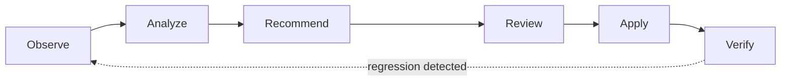

# Observability isn't enough: why we built Consize

Most Kubernetes cost tools stop at the dashboard. They'll tell you, correctly,
that a service is requesting 4 vCPUs and using 400m. What they won't do is
change it, because changing it safely in a live production cluster is a
completely different engineering problem than measuring it.

That gap is why we built Consize.

<!-- more -->

## The real blocker isn't visibility, it's risk

Teams don't sit on 30 to 50% of wasted compute and database spend because
they're unaware of it. They sit on it because the person who could fix it is
also the person who gets paged at 2am if the fix goes wrong. Faced with that
trade-off, "leave it alone" is the rational choice, every time.

Cost optimization tooling that stops at "here's what you should change" pushes
all of that risk back onto an engineer, manually, forever. It doesn't scale,
and it doesn't get prioritized against feature work. The backlog of
recommendations just grows.

## Where Kubecost fits, and where it doesn't

[Kubecost](https://www.kubecost.com/) is the gold standard for Kubernetes
cost observability and allocation: mapping cloud billing data to namespaces,
teams, and workloads so you know exactly who is spending what. If your
problem is "we don't have visibility into our cluster spend," you should be
using it.

But observing waste and *fixing waste safely* are different problems.
Consize isn't an observability replacement. It's built to compliment that
ecosystem by taking on the part observability tools intentionally leave to
humans: safe, automated action.

|  | Observability tools | Consize |
|---|---|---|
| **Finds waste** | ✅ | ✅ |
| **Recommends a fix** | ✅ | ✅ |
| **Applies the fix** | Manual | Automated, step-wise |
| **Verifies it's safe post-change** | ❌ | ✅ (SLI-monitored) |
| **Rolls back automatically on regression** | ❌ | ✅ (byte-identical) |

## How Consize closes the gap

Consize runs the same loop every time, whether it's touching a Kubernetes
workload or an idle cloud resource:



A few things about that loop that matter in practice:

- **Changes are never applied all at once.** Large rightsizing changes are
  broken into small, reversible steps.
- **Every step is verified against real SLIs.** Latency, OOM kills, CPU
  throttling, not just whether the deploy succeeded.
- **A regression triggers an instant, byte-identical rollback.** No manual
  intervention, no waiting for someone to notice in a dashboard.
- **You choose the level of automation.** Consize can open a reviewable pull
  request against your IaC repo, or apply guarded runtime changes directly,
  within boundaries you configure.

That last point matters for adoption. You don't have to hand over the keys on
day one. Most teams start with PR-only mode, build trust in the
recommendations, and expand automation gradually.

## See it catch a regression in under a minute

The fastest way to understand this is to watch it happen. Our interactive
sandbox runs entirely on your machine, no cluster, no cloud account, just
Docker:

```
docker run -p 3000:3000 -p 8080:8080 -it ghcr.io/consize-oss/consize-sandbox:latest
```

Open `http://localhost:3000` and you can watch the Verifier catch an
intentional regression on a seeded `checkout-api` workload and trigger an
automatic rollback in real time: the exact loop described above, start to
finish.

[Try the Interactive Sandbox](../../getting-started/sandbox.md){ .md-button .md-button--primary }
[Read the architecture](../../concepts/architecture.md){ .md-button }