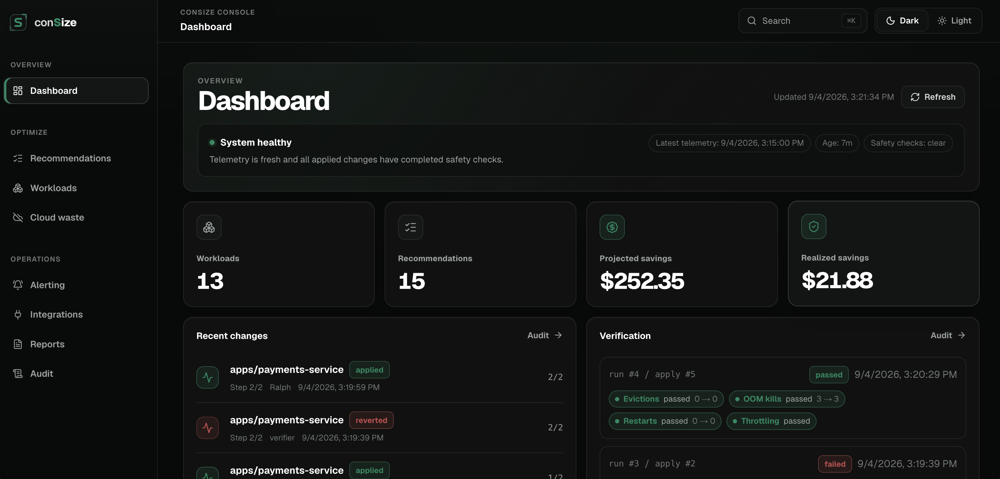
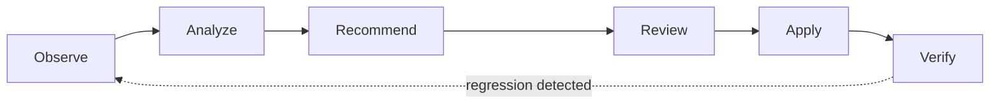

# Overview

Open Source · Kubernetes &amp; Cloud Cost Optimization

## Safe, automated infrastructure optimization

Consize helps engineering teams reduce Kubernetes and cloud waste without turning cost optimization into a production risk.

It analyzes your infrastructure, identifies optimization opportunities, and helps you apply safer changes with built-in guardrails.

[Get started](getting-started/get-started.md){ .md-button .md-button--primary }
[Try the Interactive Sandbox](getting-started/sandbox.md){ .md-button }

{ .consize-hero-shot }

---

## Get started in three steps

Go from zero to a verified rightsizing change against a real workload.

-   [:material-magnify:{ .lg .middle } **1. Analyze**](getting-started/get-started.md)

    ---

    Point Consize at a cluster. It profiles real CPU and memory usage over a rolling window — no guesswork, no assumed sizing.

-   [:material-source-pull:{ .lg .middle } **2. Review**](guides/rightsizing.md)

    ---

    Get a rightsizing pull request against your IaC repo, or apply approved changes directly through the UI within configured boundaries.

-   [:material-shield-check:{ .lg .middle } **3. Verify**](concepts/safety-net.md)

    ---

    SLIs are watched after every change. If something regresses, Consize triggers an automatic, byte-identical rollback.

## How it works

Consize continuously evaluates your infrastructure and turns resource usage data into actionable recommendations. You decide how changes are applied — through reviewable pull requests against your existing Infrastructure-as-Code workflow, or as guarded runtime changes within configured boundaries.

---

## Explore the platform

-   [:material-resize:{ .lg .middle } **Kubernetes Rightsizing**](guides/rightsizing.md)

    ---

    Reduce over-provisioned CPU and memory by adjusting requests and limits based on observed, not assumed, usage.

-   [:material-chart-line:{ .lg .middle } **Observability**](guides/observability.md)

    ---

    How the Observe → Change → Verify loop uses SLIs to confirm a change was actually safe.

-   [:material-layers-outline:{ .lg .middle } **Environments**](guides/environments.md)

    ---

    Control the scope of what Consize can observe and modify — start small and expand automation gradually.

-   [:material-sitemap:{ .lg .middle } **How Consize Works**](concepts/architecture.md)

    ---

    The full Observe → Analyze → Recommend → Review → Apply → Verify architecture, end to end.

-   [:material-shield-lock:{ .lg .middle } **The Safety Net**](concepts/safety-net.md)

    ---

    Optimize infrastructure without turning cost savings into production risk — the principle the whole system is built around.

-   [:material-cog:{ .lg .middle } **Configuration**](reference/configuration.md)

    ---

    The full reference for controlling what Consize observes, what it can change, and how it operates in your environment.

