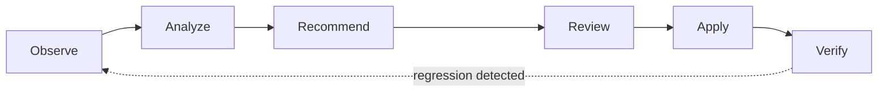

# Consize

## Safe, automated infrastructure optimization

Consize helps engineering teams reduce Kubernetes and cloud waste without turning cost optimization into a production risk.

It analyzes your infrastructure, identifies optimization opportunities, and helps you apply safer changes with built-in guardrails.

[Get started](getting-started/get-started.md){ .md-button .md-button--primary }
[Try the Interactive Sandbox](getting-started/sandbox.md){ .md-button }

---

## Why Consize?

Infrastructure optimization often involves a difficult tradeoff — **save money without breaking production.** Consize is designed to make that tradeoff safer.

-   :material-magnify:{ .lg .middle } **Workload analysis**

    ---

    Identifies optimization opportunities from real usage data.

-   :material-resize:{ .lg .middle } **Rightsizing recommendations**

    ---

    Sizing suggestions based on observed, not assumed, resource usage.

-   :material-shield-check:{ .lg .middle } **Safety checks**

    ---

    Guardrails evaluate every change before it's applied.

-   :material-chart-line:{ .lg .middle } **Verification**

    ---

    SLIs are watched after every change, with automatic rollback on regression.

-   :material-source-pull:{ .lg .middle } **Reviewable IaC changes**

    ---

    Generate a pull request through your existing Infrastructure-as-Code workflow.

-   :material-cog-sync:{ .lg .middle } **Controlled runtime changes**

    ---

    Apply approved changes directly, within configured boundaries.

## How it works

Consize continuously evaluates your infrastructure and turns resource usage data into actionable recommendations. You decide how changes are applied.

-   **:material-source-branch: Reviewable changes**

    ---

    Use Consize to generate changes that go through your existing Infrastructure-as-Code and pull request workflow.

-   **:material-robot: Guarded runtime changes**

    ---

    For teams that want automated optimization, Consize can apply approved changes directly within configured boundaries.

## Start using Consize

The fastest way to get started is to install Consize and run it against a Kubernetes environment.

[Get started](getting-started/get-started.md){ .md-button .md-button--primary }
[Try the Interactive Sandbox](getting-started/sandbox.md){ .md-button }

## Learn more

-   [:material-rocket-launch: **Quickstart**](getting-started/get-started.md)
-   [:material-package-down: **Production Installation**](getting-started/installation.md)
-   [:material-sitemap: **How Consize Works**](concepts/architecture.md)
-   [:material-shield-lock: **The Safety Net**](concepts/safety-net.md)
-   [:material-cog: **Configuration**](reference/configuration.md)

## Community

Consize is open source.

[:fontawesome-brands-github: View Consize on GitHub](https://github.com/consize-oss/consize){ .md-button }